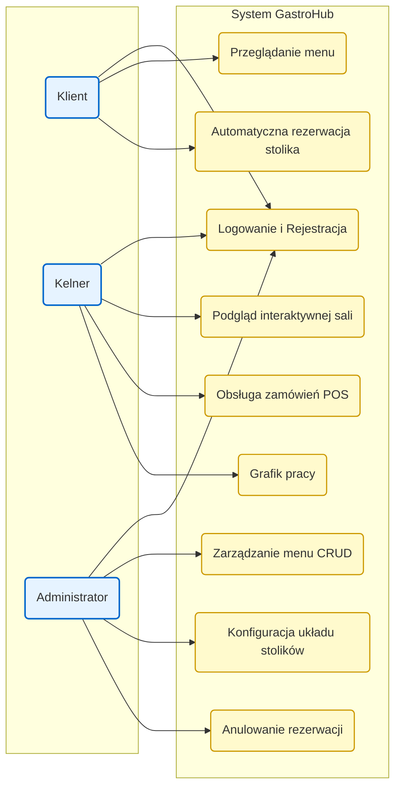
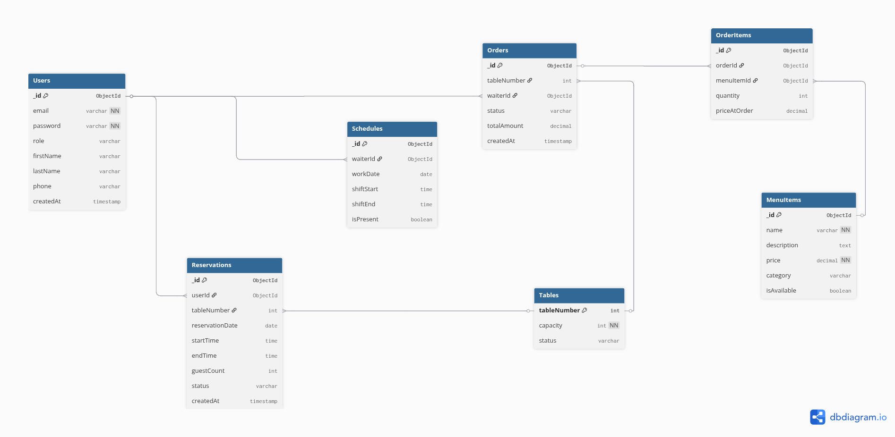

# Projekt: GastroHub

**Przedmiot:** Technologie Aplikacji Webowych II  
**Autorzy:** Kacper Szczudło, Piotr Cebula

## 1. Opis Projektu

**GastroHub** to kompleksowa aplikacja webowa do zarządzania restauracją. Łączy ona w sobie automatyczny system rezerwacji stolików dla klientów oraz panel obsługi i system POS (Point of Sale) dla personelu lokalu. Zrezygnowaliśmy z wyboru konkretnych stolików przez klientów na rzecz automatycznego przydziału, co zoptymalizuje obłożenie sali.

## 2. Podział na role i zakres funkcjonalny

### Klient
- Dostęp do aktualnego menu po zalogowaniu
- Składanie rezerwacji (data, godzina, liczba osób → automatyczny przydział stolika)
- Podgląd historii własnych rezerwacji

### Kelner
- Interaktywny podgląd sali (kafelki + statusy stolików)
- Przypisywanie się do stolika i oznaczanie stolików „z ulicy”
- System POS – otwieranie rachunku, dodawanie pozycji, zamykanie zamówienia
- Grafik pracy (deklarowanie dyspozycyjności)

### Administrator
- Zarządzanie menu (CRUD)
- Konfiguracja układu stolików (liczba, pojemność)
- Zarządzanie wszystkimi rezerwacjami (m.in. anulowanie)
- (opcjonalnie) podgląd grafików kelnerów

## 3. Stos technologiczny (MERN)

- **Frontend:** React.js (Vite)
- **Backend:** Node.js + Express.js (REST API)
- **Baza danych:** MongoDB + Mongoose
- **Autentykacja/autoryzacja:** JWT + role (client / waiter / admin)

## 4. Architektura i Diagramy

### Model Przypadków Użycia

### Diagram ERD (Entity Relationship Diagram)

