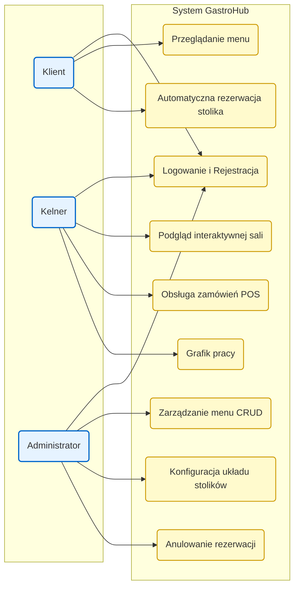

# Projekt: GastroHub


**Przedmiot:** Technologie Aplikacji Webowych II  
**Autorzy:** Kacper Szczudło, Piotr Cebula

## 1. Opis Projektu

**GastroHub** to kompleksowa aplikacja webowa do zarządzania restauracją. Łączy ona w sobie automatyczny system rezerwacji stolików dla klientów oraz panel obsługi i system POS (Point of Sale) dla personelu lokalu. Zrezygnowaliśmy z wyboru konkretnych stolików przez klientów na rzecz automatycznego przydziału, co zoptymalizuje obłożenie sali.

## 2. Podział na role i zakres funkcjonalny

### Klient
- Dostęp do aktualnego menu po zalogowaniu
- Składanie rezerwacji (data, godzina, liczba osób → automatyczny przydział stolika)
- Podgląd historii własnych rezerwacji

### Kelner
- Interaktywny podgląd sali (kafelki + statusy stolików)
- Przypisywanie się do stolika i oznaczanie stolików „z ulicy”
- System POS – otwieranie rachunku, dodawanie pozycji, zamykanie zamówienia
- Grafik pracy (deklarowanie dyspozycyjności)

### Administrator
- Zarządzanie menu (CRUD)
- Konfiguracja układu stolików (liczba, pojemność)
- Zarządzanie wszystkimi rezerwacjami (m.in. anulowanie)
- (opcjonalnie) podgląd grafików kelnerów

## 3. Stos technologiczny (MERN)

- **Frontend:** React (Vite), TypeScript, Tailwind CSS
- **Backend:** Node.js + Express (REST API, moduły ESM)
- **Baza danych:** MongoDB + Mongoose
- **Autentykacja/autoryzacja:** JWT + role (client / waiter / admin)
- **Testy:** Vitest (backend + frontend), React Testing Library (komponenty UI)

## 4. Architektura i Diagramy

### Model Przypadków Użycia



### Diagram ERD (Entity Relationship Diagram)

Obraz powinien leżeć w repozytorium pod ścieżką `docs/DiagramERD.png` (jeśli go brakuje, dodaj wyeksportowany diagram do folderu `docs/`).


## 5. Struktura repozytorium

| Katalog | Zawartość |
|--------|-----------|
| `client/` | Aplikacja React (Vite, TS, Tailwind), testy Vitest |
| `server/` | API Express, Mongoose, testy Vitest |
| `docs/` | Diagram ERD, dokumentacja API, kolekcja Postman |

## 6. Uruchomienie lokalne

### Wymagania

- Node.js (zalecany LTS)
- Działająca instancja MongoDB (lokalnie lub w chmurze)

### Zmienne środowiskowe

**Backend** — plik `server/.env` (wzór: [`server/.env.example`](server/.env.example)):

| Zmienna | Opis |
|--------|------|
| `MONGO_URI` | Connection string do MongoDB |
| `JWT_SECRET` | Tajny klucz do podpisywania i weryfikacji JWT |
| `PORT` | Port HTTP API (opcjonalny — domyślna wartość jest w `server/src/server.js`) |

Opcjonalnie: `SEED_DEMO_USERS=true` — przy starcie serwera zakładane są konta demo (logika w `server/src/modules/auth/auth.service.js`).

**Frontend** — skopiuj `client/.env.example` do `client/.env` i ustaw `VITE_API_URL` (oraz ewentualnie `VITE_APP_NAME`) tak, żeby wskazywały na Twoje API. W dev sprawdź też proxy `/api` w `client/vite.config.js`.

### Instalacja i serwery developerskie

```bash
# Terminal 1 — API
cd server && npm install && npm run dev

# Terminal 2 — UI
cd client && npm install && npm run dev
```

Porty i hosty zależą od Twojej konfiguracji (Vite wypisze adres frontu w konsoli; backend — zgodnie z `PORT` w `.env`).

### Linux: watcher plików (EMFILE / inotify)

- **Klient (Vite):** `npm run dev:poll` lub `GASTROHUB_POLL=1` — konfiguracja w `client/vite.config.js`
- **Serwer (nodemon):** `npm run dev:poll` (`--legacy-watch`)

## 7. Testy

Stack: **Vitest**; na kliencie dodatkowo **Testing Library** i **jsdom**.

```bash
cd server && npm test              # jednorazowy przebieg
cd server && npm run test:watch  # tryb watch

cd client && npm test
cd client && npm run test:watch
```

Przy błędzie `EMFILE: too many open files` w trybie watch: `npm run test:watch:poll` w katalogu `server/` lub `client/` (wymusza polling; szczegóły w `vitest.config.js` / `vite.config.js`).

## 8. Build, lint i typy (frontend)

```bash
cd client && npm run build
cd client && npm run lint
cd client && npm run type-check
```

## 9. Dokumentacja API

- Przykłady zapytań: [`docs/api.md`](docs/api.md)
- Kolekcja Postman: [`docs/GastroHubApi.postman_collection.json`](docs/GastroHubApi.postman_collection.json)
