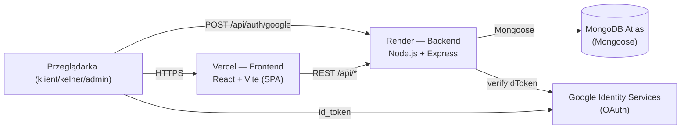
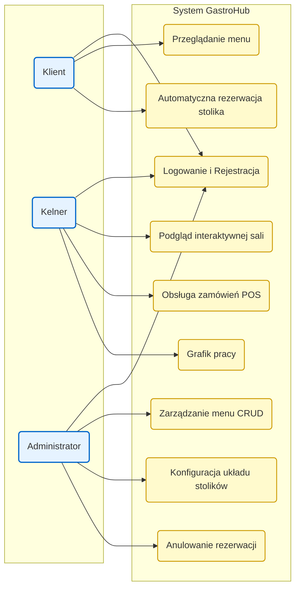

# Architektura i Diagramy

## 1. Stos technologiczny (MERN)

| Warstwa | Technologia | Wersja |
|--------|-------------|--------|
| Frontend | React + Vite + TypeScript + Tailwind CSS | React 19.2 · Vite 7.3 · TS 6.0 · Tailwind 4.2 |
| Backend | Node.js + Express (ESM) | Express 5.2 |
| Baza danych | MongoDB + Mongoose | Mongoose 9.2 |
| Autoryzacja | JWT + role + Google OAuth | `jsonwebtoken` 9.0 · `google-auth-library` 10.6 |
| Testy | Vitest + Testing Library + jsdom | Vitest 3.2 |
| Hosting frontu | Vercel | — |
| Hosting API | Render | — |

## 2. Architektura logiczna (high-level)



## 3. Model przypadków użycia



## 4. Diagram ERD (Entity Relationship Diagram)


Główne kolekcje MongoDB (zdefiniowane jako modele Mongoose w `server/src/modules/*`):

| Kolekcja | Model | Najważniejsze pola |
|----------|-------|--------------------|
| `users` | `auth/user.model.js` | `email`, `passwordHash`, `role` (`client` / `waiter` / `admin`), `googleId` |
| `menuitems` | `menu/menu.model.js` | `name`, `description`, `price`, `category`, `imageBase64` |
| `tables` | `table/table.model.js` | `tableNumber`, `capacity`, `position`, `status` |
| `reservations` | `reservation/reservation.model.js` | `userId`, `tableId`, `reservationDate`, `startTime`, `endTime`, `numberOfGuests`, `status` |
| `orders` | `order/order.model.js` | `tableId`, `waiterId`, `items[]`, `totalPrice`, `status` |
| `schedules` | `schedule/schedule.model.js` | `userId`, `date`, `shift` |

## 5. Warstwy aplikacji (backend)

```
server/src/
├── app.js                # konfiguracja Express + montaż routerów
├── server.js             # bootstrap (DB connect, cron prune)
├── database/connect.js   # połączenie z Mongo
├── middlewares/          # auth, role guard, error handler
└── modules/
    ├── auth/             # routes · controller · service · model
    ├── menu/
    ├── table/
    ├── reservation/
    ├── order/
    └── schedule/
```

Każdy moduł trzyma się układu **routes → controller → service → model**, co ułatwia testy
jednostkowe (Vitest) bez stawiania całego serwera HTTP.

## 6. Warstwy aplikacji (frontend)

```
client/src/
├── main.tsx              # wejście (Google OAuth provider)
├── App.tsx               # router widoków na podstawie roli + currentView
├── components/
│   ├── common/           # Header, LoginScreen
│   ├── client/           # ClientMenu, ClientReservation, ClientReservationsList
│   ├── waiter/           # FloorPlan, WaiterPOS, TableModal
│   └── admin/            # AdminMenuManager, AdminReservationsManager, ScheduleView
├── context/              # AuthContext, MenuDataContext, TablesContext, ...
├── services/             # axios + obsługa API
└── ...
```

Stan globalny jest realizowany przez `React Context` (m.in. `AuthContext`, `NavigationContext`,
`MenuDataContext`, `TablesContext`, `ReservationsContext`, `ScheduleContext`, `UiFeedbackContext`).
Wszystkie providery są zagnieżdżone w `AppProviders.tsx`.
