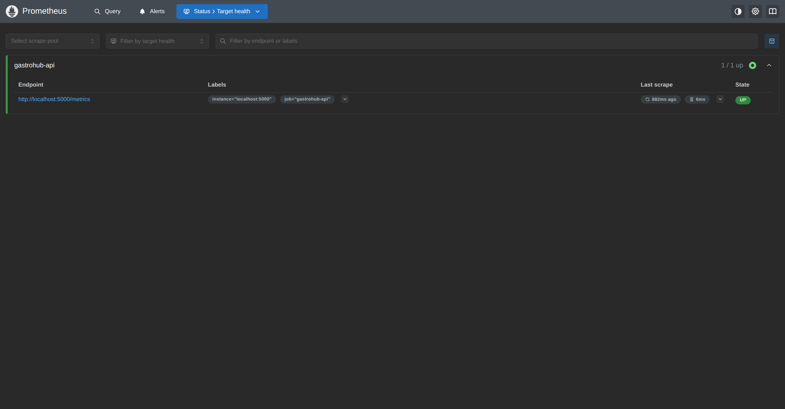
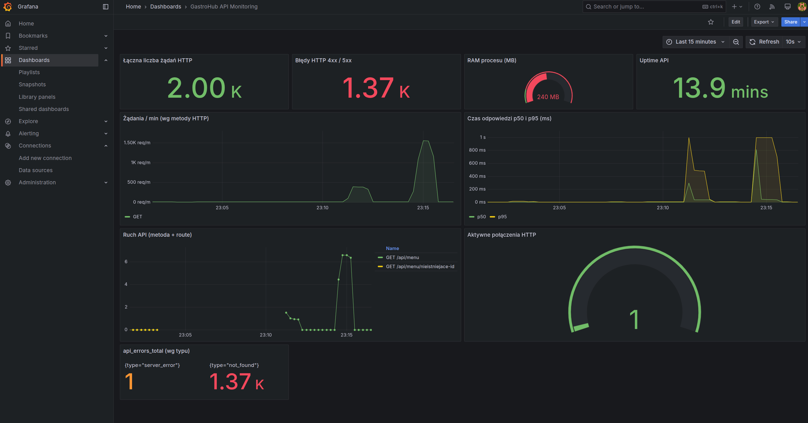

# Monitoring (Prometheus + Grafana)

Ten dokument opisuje wdrożenie monitoringu backendu **GastroHub API** (Node.js + Express) przy użyciu **prom-client**, **Prometheus** i **Grafana** (bez Dockera) — w stylu krok‑po‑kroku, jak w instrukcji laboratoryjnej.

## 1. Jak to działa (skrót)

- Aplikacja udostępnia endpoint `GET /metrics`, który zwraca metryki w formacie Prometheusa.
- **Prometheus** działa w modelu *pull* i co kilka sekund odpyta `http://localhost:<PORT>/metrics`.
- **Grafana** wizualizuje metryki z Prometheusa (PromQL).

Uwaga o etykietach (kardynalność): nie używamy jako label czegoś unikalnego na każde żądanie (np. id usera, pełny URL z id). Zamiast `/api/tables/507f...` używamy wzorca routy `/api/tables/:id`.

## 2. Backend (prom-client, middleware, /metrics)

### 2.1. Instalacja zależności

```bash
cd server
npm install
```

`prom-client` jest już dodany w backendzie.

### 2.2. Metryki i middleware

W backendzie zdefiniowane są:
- `http_requests_total` (Counter) – liczba żądań HTTP z etykietami: `method`, `route`, `status_code`
- `http_request_duration_ms` (Histogram) – czasy odpowiedzi w ms (do p50/p95)
- `active_connections` (Gauge) – aktywnie obsługiwane żądania
- `api_errors_total` (Counter) – błędy API wg typu: `not_found`, `bad_request`, `server_error`

Źródła w kodzie:
- Metryki: `server/src/metrics/index.js`
- Middleware: `server/src/middlewares/metricsMiddleware.js`
- Error handler + logowanie błędów + `api_errors_total`: `server/src/middlewares/errorHandler.js`

### 2.3. Endpoint `/metrics`

Endpoint jest podpięty w `server/src/app.js`:
- `GET /metrics` zwraca `register.metrics()` z odpowiednim `Content-Type`.

### 2.4. Uruchomienie backendu i weryfikacja

```bash
cd server
npm run dev
```

W drugim terminalu:

```bash
curl http://localhost:5000/metrics | head -n 20
```

Jeśli widzisz linie zaczynające się od `# HELP` / `# TYPE`, backend jest gotowy.

## 3. Prometheus

### 3.1. Instalacja (Linux)

Pobierz archiwum `tar.gz` ze strony `prometheus.io/download`, rozpakuj i uruchamiaj binarkę `prometheus`.

### 3.2. Konfiguracja scrapowania

W repo znajduje się gotowy plik `prometheus.yml`. Najważniejsze parametry:
- `scrape_interval: 5s`
- `targets: ["localhost:5000"]`
- `metrics_path: /metrics`

### 3.3. Uruchomienie

Uruchom Prometheusa wskazując plik konfiguracyjny (uruchamiasz z katalogu repo):

```bash
./prometheus --config.file=./prometheus.yml
```

W praktyce, jeśli binarka jest w innym katalogu, podajesz pełną ścieżkę do `prometheus` oraz do `prometheus.yml`.

### 3.4. Weryfikacja działania

1. Otwórz UI: `http://localhost:9090`
2. Wejdź w `Status → Targets` i sprawdź, czy `gastrohub-api` ma status **UP**.
3. W zakładce `Query` wpisz i uruchom:

```promql
http_requests_total
```

Powinieneś zobaczyć serie z etykietami `method/route/status_code`.

## 4. Grafana

### 4.1. Instalacja

Zainstaluj Grafanę (Linux: pakiet systemowy lub tarball ze strony Grafany). Następnie uruchom i wejdź na:
`http://localhost:3000`.

### 4.2. Dodanie datasource Prometheus

1. `Connections → Data sources → Add new data source`
2. Wybierz **Prometheus**
3. `Prometheus server URL`: `http://localhost:9090`
4. `Save & test` → zielony komunikat

### 4.3. Import dashboardu

W repo jest gotowy dashboard: `grafana-dashboard.json`.

1. `Dashboards → Import`
2. `Upload dashboard JSON file` → wybierz `grafana-dashboard.json`
3. W polu Prometheus wybierz datasource z pkt 4.2
4. `Import`

Dashboard zawiera panele m.in. dla:
- łącznej liczby żądań
- błędów 4xx/5xx
- RAM procesu i uptime
- p50/p95 czasu odpowiedzi
- aktywnych połączeń
- `api_errors_total` (wg typu)

## 5. Zapytania PromQL

```promql
sum by(status_code) (http_requests_total)
```

```promql
rate(http_requests_total[1m])
```

```promql
sum by(method) (rate(http_requests_total[1m]))
```

P95 opóźnień:

```promql
histogram_quantile(0.95, sum(rate(http_request_duration_ms_bucket[1m])) by (le))
```

RAM procesu (MB):

```promql
process_resident_memory_bytes / 1024 / 1024
```

Metryka błędów API:

```promql
sum by(type) (api_errors_total)
```

## 6. Logowanie błędów i monitorowanie wydajności

### 6.1. Logowanie błędów (serwer)

W `server/src/middlewares/errorHandler.js` logujemy:
- czas wystąpienia (ISO)
- typ błędu (4xx/5xx)
- kontekst: metoda, ścieżka, IP, User-Agent

Równolegle inkrementujemy metrykę `api_errors_total{type=...}`.

### 6.2. Monitorowanie czasu odpowiedzi

Middleware metryk zapisuje czas w histogramie `http_request_duration_ms`, co umożliwia liczenie percentyli (p50/p95) w PromQL/Grafanie.

## 7. Test stabilności pod obciążeniem

W repo dodany jest prosty load test bez dodatkowych zależności: `server/scripts/loadTest.js`.

Przykład:

```bash
cd server
npm run loadtest -- --url http://localhost:5000/api/menu --duration 15 --concurrency 25
```

Żeby wygenerować błędy i nabić `api_errors_total`:

```bash
cd server
npm run loadtest -- --url http://localhost:5000/api/tables/000000000000000000000000/ --duration 10 --concurrency 10
```

Po teście w Prometheusie/Grafanie sprawdź `sum by(type) (api_errors_total)`.

## 8. Screenshots (podgląd w dokumentacji)

Prometheus Targets (job `gastrohub-api` = UP):



Grafana dashboard (z panelem `api_errors_total`):



