# Makiety i Opis Layoutu Głównych Widoków

Dokument opisuje strukturę interfejsu użytkownika aplikacji **GastroHub** w podziale na role
(Niezalogowany / Klient / Kelner / Administrator). Wszystkie zrzuty ekranu pochodzą z działającej
wersji produkcyjnej dostępnej pod adresem [https://gastro-hub.me](https://gastro-hub.me).

Globalna struktura każdego widoku:

- **Header (sticky)** — logo `GastroHub`, dane kontaktowe lokalu, badge z rolą oraz przycisk *Wyloguj*.
- **Pasek nawigacji** zależny od roli (light dla klienta, ciemny dla kelnera, fioletowy dla administratora).
- **Strefa główna** — pełnoekranowa zawartość widoku.
- **Modale** (np. szczegóły stolika, formularz dodawania pozycji) wyświetlane nad treścią.

Stack UI: **React 19 + Vite 7 + TypeScript + Tailwind CSS 4**, ikony z `lucide-react`.

---

## 1. Widoki publiczne (niezalogowany)

### 1.1 Logowanie

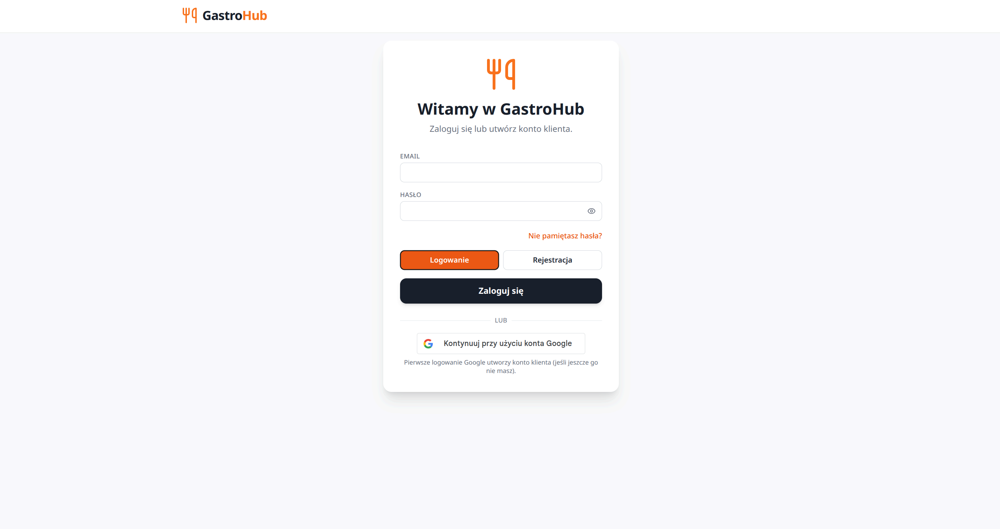

Layout:

- Wycentrowana karta na jasnym tle (max szerokość ~`max-w-md`).
- Logo + nagłówek *„Witamy w GastroHub”* + podtytuł zachęcający do logowania/rejestracji.
- Pola `EMAIL` i `HASŁO` z ikoną „pokaż hasło”.
- Link *„Nie pamiętasz hasła?”* (wyrównany do prawej, kolor akcentowy).
- Toggle **Logowanie / Rejestracja** (dwa przyciski w jednym kontenerze).
- Główne CTA (czarny przycisk *Zaloguj się*).
- Separator `LUB` + przycisk **Continue with Google** (Google Identity Services).
- Notka informacyjna o automatycznym tworzeniu konta klienta przy pierwszym logowaniu Google.

### 1.2 Rejestracja

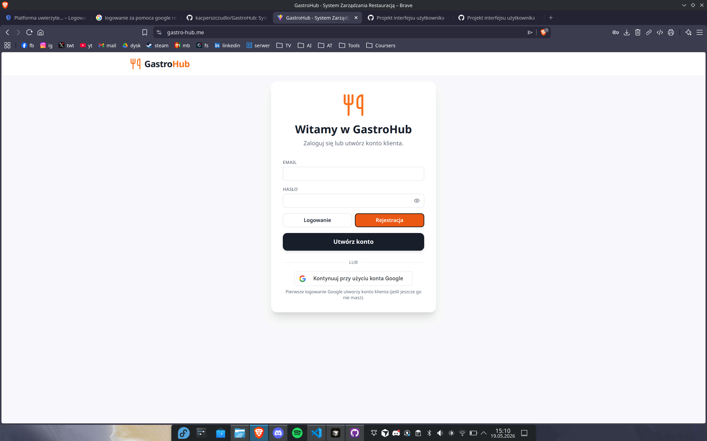

Wariant tej samej karty z aktywnym tabem **Rejestracja**:

- Identyczne pola `EMAIL` i `HASŁO`.
- Główne CTA zmienia się na *Utwórz konto*.
- Po stronie API: `POST /api/auth/register` — domyślnie rejestrowani są klienci.

---

## 2. Widoki klienta

Nawigacja klienta: `Menu Restauracji` · `Rezerwuj Stolik` · `Moje Rezerwacje` (jasny pasek pod headerem).

### 2.1 Menu Restauracji

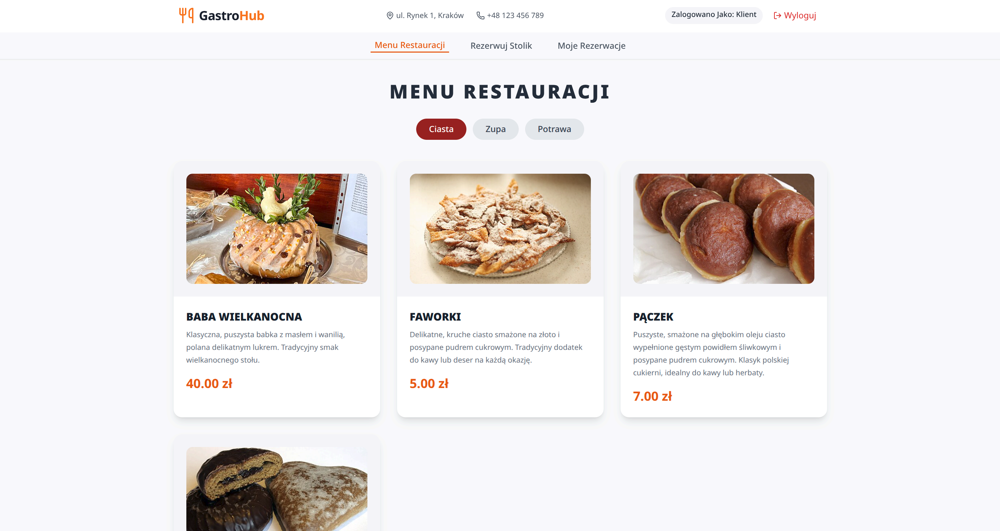

Layout:

- Wycentrowany nagłówek `MENU RESTAURACJI` (wersaliki, duża typografia).
- Pasek filtrów kategorii (chipy: *Ciasta*, *Zupa*, *Potrawa*) z aktywnym chipem w kolorze akcentowym.
- Grid `grid-cols-1 md:grid-cols-2 lg:grid-cols-3` z kartami pozycji menu:
  - kwadratowe zdjęcie potrawy u góry,
  - nazwa wersalikami, opis krótkim akapitem,
  - cena w kolorze akcentowym (`text-orange-600`) wyrównana do lewej.

### 2.2 Rezerwacja stolika

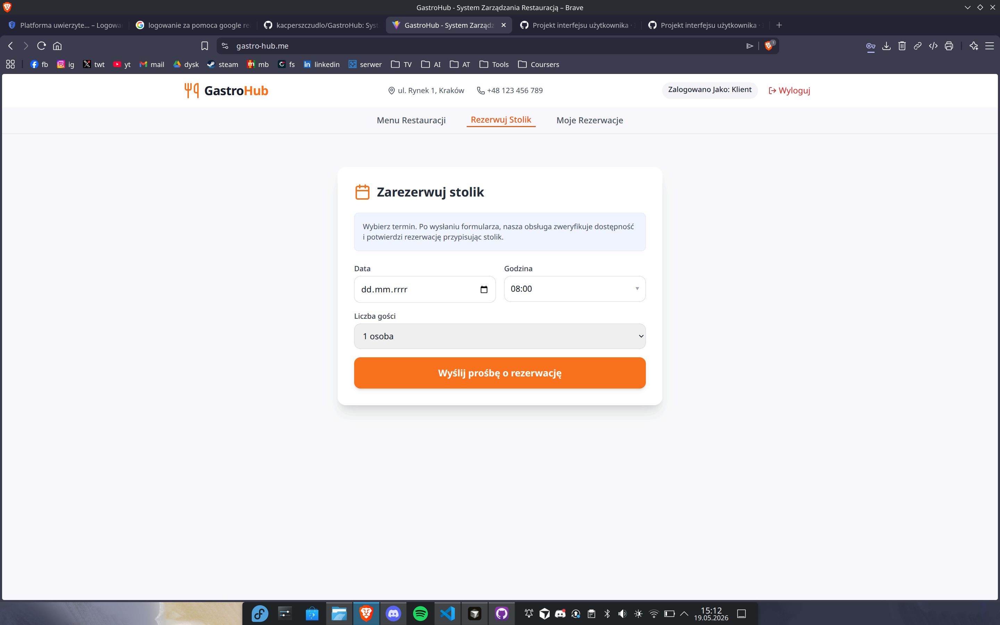

Layout:

- Wycentrowana karta z ikoną kalendarza i tytułem *Zarezerwuj stolik*.
- Krótka informacja o weryfikacji ręcznej.
- Pola: **Data** (`<input type="date">`), **Godzina** (`<select>` z paskiem przewijania co 30 min),
  **Liczba gości** (`<select>` 1–8).
- Główne CTA: pomarańczowy przycisk *Wyślij prośbę o rezerwację* (pełna szerokość).
- Po stronie API: `POST /api/reservations` — system automatycznie przypisuje stolik (lub odrzuca,
  gdy brak wolnych miejsc na podany przedział czasu).

### 2.3 Moje rezerwacje

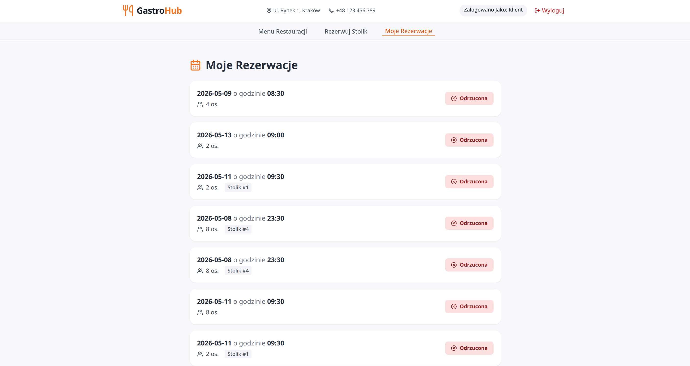

Layout:

- Nagłówek *Moje Rezerwacje* z ikoną kalendarza.
- Pionowa lista kart (jedna karta = jedna rezerwacja) z miękkimi cieniami.
- Każda karta zawiera:
  - datę i godzinę (pogrubione akcenty),
  - liczbę osób (ikona ludzi),
  - oznaczenie stolika (`#1`, `#4`, …) jako badge,
  - status po prawej (`Zrealizowana` / `Odrzucona` / `Oczekująca` — kolor zależny od statusu).

---

## 3. Widoki kelnera

Nawigacja kelnera (ciemny pasek): `Sala & Stoliki` · `System POS` · `Mój Grafik`.

### 3.1 Sala i stoliki

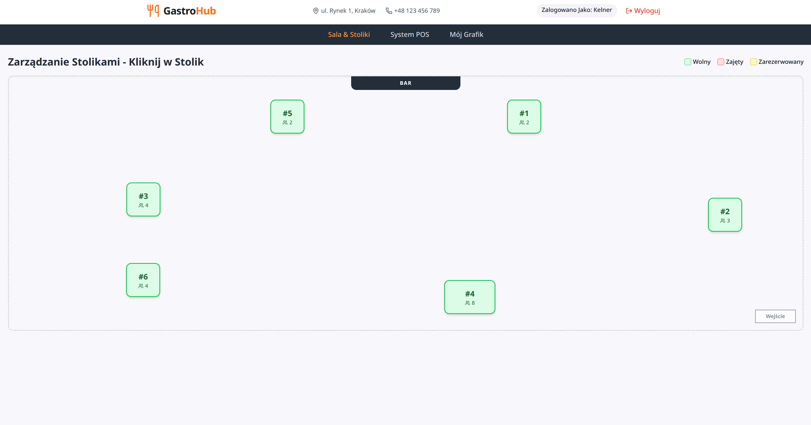

Layout:

- Pełnoekranowy „plan sali” na jasnym tle z przerywaną obwódką.
- Etykieta `BAR` u góry oraz `Wejście` w prawym dolnym rogu jako kotwice orientacyjne.
- Stoliki jako kafelki (`#numer` + ikona ludzi z pojemnością) rozmieszczone wg konfiguracji administratora.
- Kolor obwódki kafelka odpowiada statusowi:
  - zielony — `Wolny`,
  - czerwony — `Zajęty`,
  - żółty — `Zarezerwowany`.
- Legenda kolorów w prawym górnym rogu.
- Kliknięcie kafelka otwiera **modal stolika** (przypisanie kelnera, otwarcie rachunku, oznaczenie „z ulicy”).

### 3.2 System POS

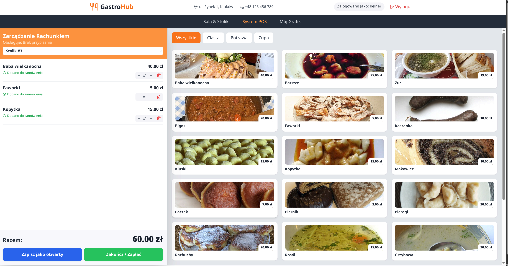

Layout dwukolumnowy:

- **Lewa kolumna (sticky):** *Zarządzanie Rachunkiem*
  - select wyboru stolika,
  - lista pozycji rachunku z kontrolą ilości `- x N +` i koszem,
  - suma `Razem:` u dołu,
  - dwa CTA: *Zapisz jako otwarty* (niebieski) i *Zakończ / Zapłać* (zielony).
- **Prawa kolumna:** *Menu*
  - filtry kategorii (`Wszystkie`, `Ciasta`, `Potrawa`, `Zupa`),
  - grid kart pozycji (zdjęcie, nazwa, cena) — klik dodaje pozycję do rachunku.
- Po stronie API: `POST /api/orders`, `PUT /api/orders/:id/status`.

### 3.3 Mój grafik

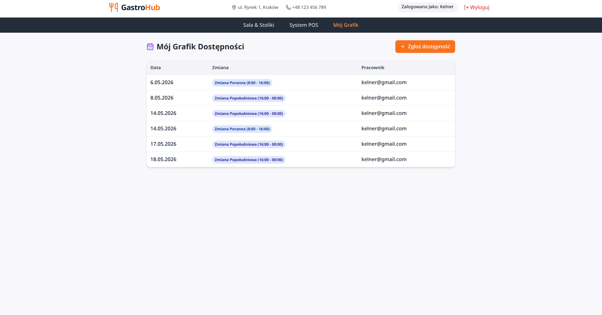

Layout:

- Nagłówek *Mój Grafik Dostępności* + ikona kalendarza.
- Pomarańczowe CTA *+ Zgłoś dostępność* otwiera modal z wyborem daty i zmiany.
- Tabela trzykolumnowa: `Data` · `Zmiana` · `Pracownik`.
- Zmiana renderowana jako badge (np. *Zmiana Poranna (8:00 - 16:00)*).

---

## 4. Widoki administratora

Nawigacja administratora (fioletowy pasek): `Układ Sali` · `Rezerwacje` · `Grafiki Pracy` · `Menu (CRUD)`.

### 4.1 Układ Sali — tryb zarządzania

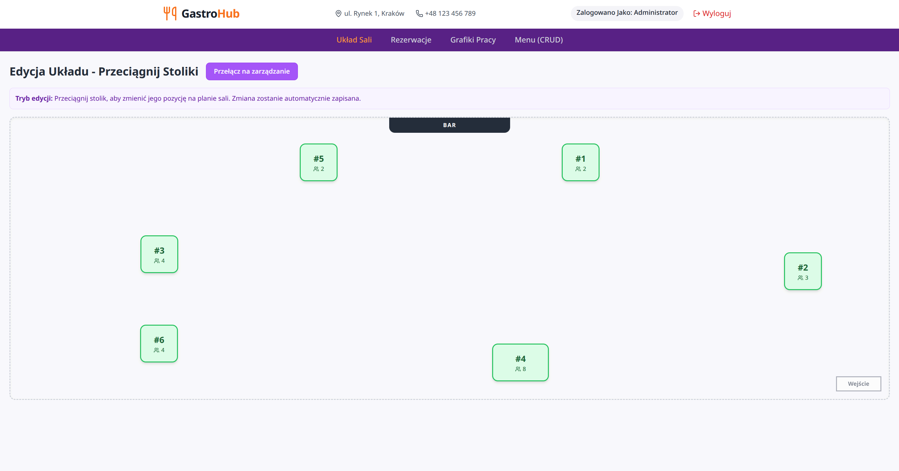

Layout identyczny z widokiem kelnera, ale z dodatkowym przyciskiem *Przełącz na edycję układu*
oraz pełnym dostępem do statusów stolików. Z tego ekranu administrator może:

- klikać stoliki i ręcznie zmieniać ich status,
- przełączyć się w tryb edycji rozmieszczenia (`/admin_dashboard`).

### 4.2 Układ Sali — tryb edycji (drag & drop)

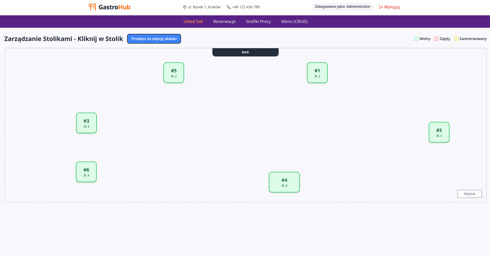

Layout:

- Nagłówek *Edycja Układu — Przeciągnij Stoliki* z fioletowym CTA *Przełącz na zarządzanie*.
- Banner instruktażowy (`Tryb edycji: Przeciągnij stolik, aby zmienić jego pozycję na planie sali.
  Zmiana zostanie automatycznie zapisana.`).
- Kafelki stolików są **draggable** — pozycja zapisuje się przez `PUT /api/tables/:id` po upuszczeniu.

### 4.3 Rezerwacje (admin)

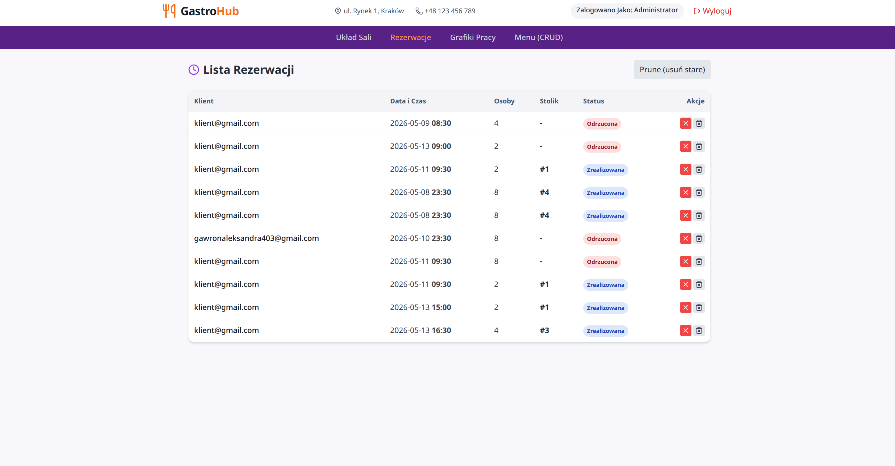

Layout:

- Nagłówek *Lista Rezerwacji* z ikoną zegara.
- Przycisk *Prune (usuń stare)* — ręcznie wywołuje `pruneReservations` (czyszczenie starych rekordów).
- Tabela: `Klient` · `Data i Czas` · `Osoby` · `Stolik` · `Status` · `Akcje`.
- Status jako kolorowy badge (`Odrzucona`, `Zrealizowana`, `Oczekująca`).
- Akcje w wierszu: ikonka odrzucenia (X) i kosz (usunięcie z bazy).

### 4.4 Grafiki Pracy (admin)

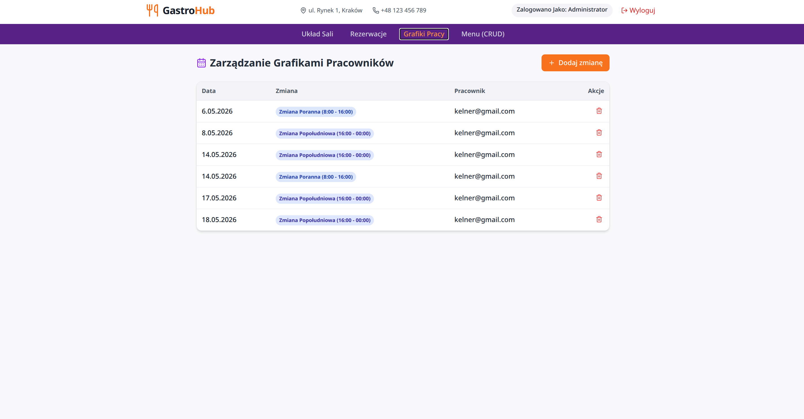

Layout:

- Nagłówek *Zarządzanie Grafikami Pracowników*.
- CTA *+ Dodaj zmianę* (pomarańczowy) otwiera modal z wyborem pracownika, daty i typu zmiany.
- Tabela `Data` · `Zmiana` · `Pracownik` · `Akcje` (kosz).

### 4.5 Menu (CRUD)

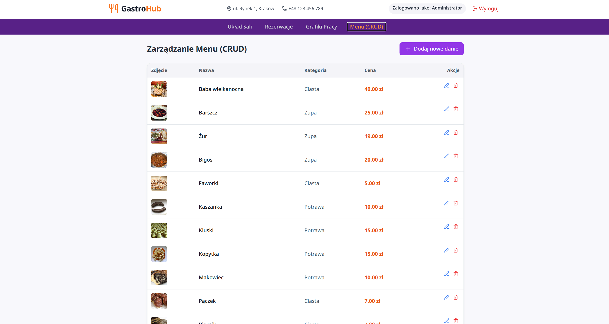

Layout:

- Nagłówek *Zarządzanie Menu (CRUD)*.
- CTA *+ Dodaj nowe danie* otwiera modal z polami `name`, `description`, `price`, `category`
  oraz uploadem zdjęcia (base64).
- Tabela: `Zdjęcie` · `Nazwa` · `Kategoria` · `Cena` · `Akcje` (edycja w modalu / usunięcie).
- Endpointy: `POST /api/menu`, `PUT /api/menu/:id`, `DELETE /api/menu/:id`.

---

## 5. Wspólne komponenty UI

| Komponent | Plik | Krótki opis |
|-----------|------|-------------|
| `Header` | `client/src/components/common/Header.tsx` | Sticky header + nawigacja zależna od roli |
| `LoginScreen` | `client/src/components/common/LoginScreen.tsx` | Karta logowania + rejestracji + Google OAuth |
| `FloorPlan` | `client/src/components/waiter/FloorPlan.tsx` | Plan sali (zarządzanie + edycja drag&drop) |
| `TableModal` | `client/src/components/waiter/TableModal.tsx` | Modal szczegółów stolika |
| `WaiterPOS` | `client/src/components/waiter/WaiterPOS.tsx` | Dwu­kolumnowy POS |
| `AdminMenuManager` | `client/src/components/admin/AdminMenuManager.tsx` | Tabela CRUD menu |
| `AdminReservationsManager` | `client/src/components/admin/AdminReservationsManager.tsx` | Tabela rezerwacji |
| `ScheduleView` | `client/src/components/admin/ScheduleView.tsx` | Grafik dla kelnera i admina (różne uprawnienia) |
| `ClientMenu` | `client/src/components/client/ClientMenu.tsx` | Widok publiczny menu z filtrami |
| `ClientReservation` | `client/src/components/client/ClientReservation.tsx` | Formularz rezerwacji |
| `ClientReservationsList` | `client/src/components/client/ClientReservationsList.tsx` | Lista własnych rezerwacji |

## 6. System kolorów (Tailwind)

- **Akcent / CTA klienta:** `orange-500` / `orange-600`.
- **Tło administratora:** `purple-900` (pasek nawigacji).
- **Tło kelnera:** `gray-800` (pasek nawigacji).
- **Statusy stolików:** `green-500` (wolny), `red-500` (zajęty), `yellow-400` (zarezerwowany).
- **Statusy rezerwacji:** `blue-100/700` (zrealizowana), `red-100/700` (odrzucona), `yellow-100/800` (oczekująca).
- **Karty / kontenery:** `bg-white shadow-sm rounded-lg` na tle `bg-gray-50`.
